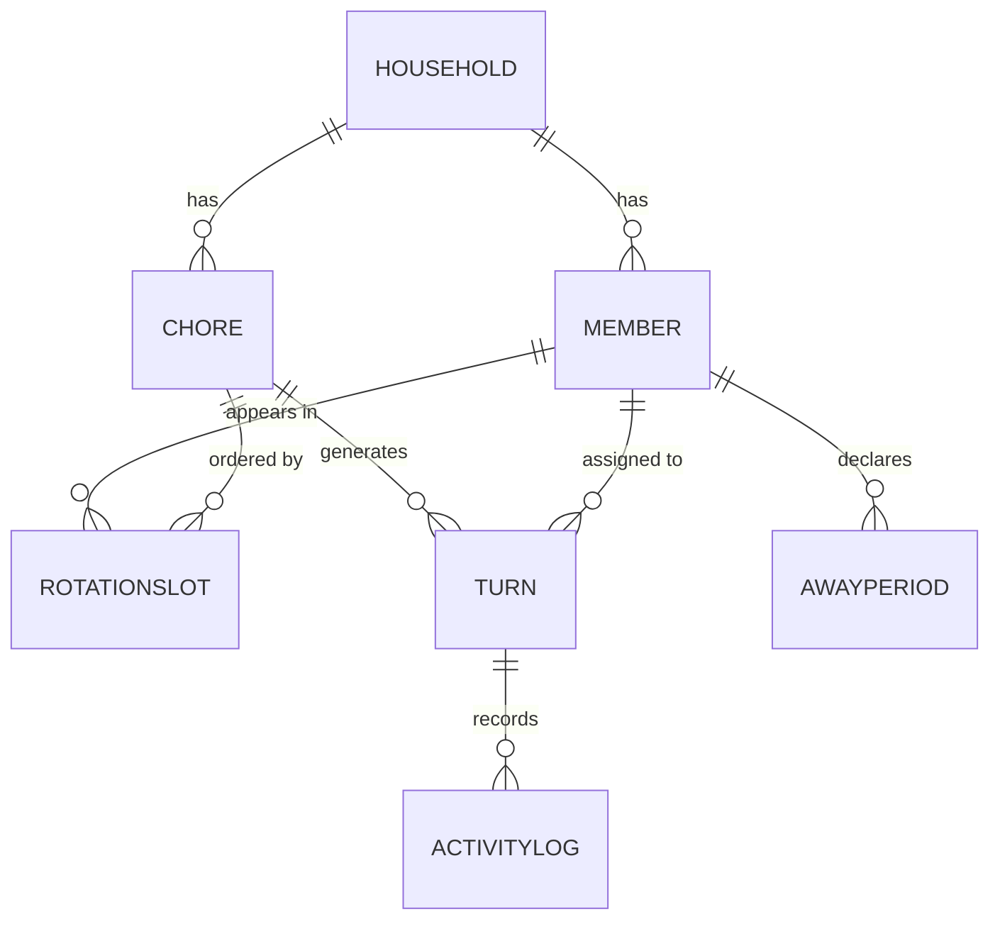
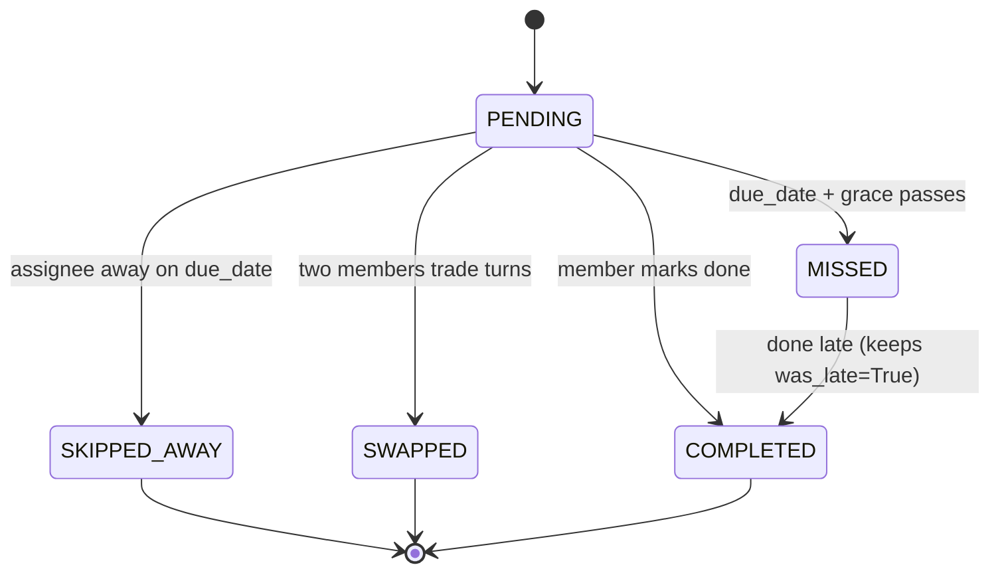

# Chore Manager — Technical Architecture

**Status:** Design only. No application code written yet.
**Source of truth for scope:** [`plan.md`](./plan.md). This document translates those product decisions into a Django architecture and records the technical decisions each one forces.

---

## 0. Change of constraint: we now have a backend

`plan.md` §6 rejected email reminders because *"a client-side web app with no backend server cannot actually send real emails."*

**That constraint no longer holds.** Django is a server-side framework with a first-class email backend and a management-command/cron story. The in-app-only reminder decision is kept for the MVP because it is the simplest thing that satisfies the underlying goal, but it is now a **scope choice, not a technical limitation** — see §9 for the ~1-day path to real email reminders.

No other decision in `plan.md` is affected by the platform change.

---

## 1. Stack

| Layer | Choice | Why |
|---|---|---|
| Framework | Django 5.2 LTS | Batteries-included auth, ORM, admin, migrations — all four are load-bearing here |
| Rendering | Django templates, server-rendered | The whole app is forms + lists. A SPA would add a build step and an API layer for no benefit |
| Interactivity | htmx (vendored static file) | "Mark complete" and "mark away" become partial-page swaps without a JS framework |
| Database | SQLite (dev) → PostgreSQL (prod) | ORM-portable; only §5's `select_for_update` and `UniqueConstraint` matter, both work on either |
| Settings | `django-environ` + `.env` | Keeps `SECRET_KEY`/DB URL out of the repo |
| Static | WhiteNoise | Serves static files from the app process; no separate nginx needed for a household-scale app |
| Server | Gunicorn | Standard WSGI |
| Test | pytest + pytest-django | Fixtures make the rotation/turn-generation tests (§4) far more readable than `TestCase` |
| Lint | Ruff | Lint + format in one tool |

Installed and pinned in `requirements.txt`; virtualenv at `.venv/`.

---

## 2. Project layout

```
config/                  # project package
  settings/
    base.py              # shared
    dev.py               # DEBUG, SQLite, debug-toolbar
    prod.py              # WhiteNoise, secure cookies, ALLOWED_HOSTS
  urls.py  wsgi.py  asgi.py

accounts/                # Household, Member (custom user), PIN auth
  models.py  backends.py  views.py  forms.py  mixins.py

chores/                  # Chore definitions + per-chore rotation order
  models.py  views.py  forms.py

schedule/                # Turns, away periods, swaps — the engine
  models.py
  services/
    generation.py        # materialize future turns
    transitions.py       # complete / miss / skip / swap
  management/commands/
    generate_turns.py
    mark_overdue.py

core/                    # base templates, template tags, shared mixins
templates/  static/
```

Four apps, split by **who owns the data**, not by layer. `schedule` is deliberately separate from `chores`: a `Chore` is a stable definition, a `Turn` is a dated occurrence, and they change for completely different reasons.

---

## 3. Data model



### `accounts.Household`
`name`, `timezone`, `created_at`. Every other row hangs off this. Present from day one even though there is one household — it is what makes "custom list of roommates" (`plan.md` §1) a row set rather than a constant, and it is the scoping key for every queryset (§6).

### `accounts.Member` — the custom user model
Subclasses `AbstractBaseUser` + `PermissionsMixin`.

| Field | Notes |
|---|---|
| `household` | FK |
| `display_name` | what other roommates see |
| `USERNAME_FIELD` | `display_name`, unique per household |
| `password` | inherited — stores the **hashed PIN**, never a plaintext PIN |
| `is_admin` | `plan.md` §7 role flag |
| `is_active` | soft-remove a departed roommate without destroying their history |
| `joined_on` | rotation insert point |

> **Sequencing:** `AUTH_USER_MODEL` must be set and `Member` defined **before the first `makemigrations`**. Retrofitting a custom user model onto existing migrations is a painful rebuild. This is the single most order-dependent step in the build.

### `chores.Chore`
`household`, `name`, `description`, `cadence_unit` (`DAY`/`WEEK`/`MONTH`), `cadence_interval` (int), `anchor_date`, `is_active`, `grace_days`.

`plan.md` §2 requires per-chore cadence *and* per-chore rotation order, so cadence lives here, not on the household.

### `chores.RotationSlot`
Through model on `Chore` ↔ `Member` with `position` (int). `unique_together: (chore, position)` and `(chore, member)`.

An explicit through model — rather than reusing member order household-wide — is what lets "trash" and "bathroom" cycle in different orders, which §2 calls for.

### `schedule.Turn` — one occurrence of one chore
| Field | Notes |
|---|---|
| `chore`, `assignee` | assignee **snapshotted at generation time** |
| `cycle_index` | monotonic per chore |
| `period_start`, `due_date` | dates, not datetimes |
| `status` | see state machine below |
| `completed_at`, `completed_by` | `completed_by` ≠ `assignee` when someone covers |
| `swapped_with` | self-FK to the paired turn |
| `note` | free text |

`UniqueConstraint(chore, cycle_index)` — the idempotency guard that makes turn generation safe to re-run (§4).

### `schedule.AwayPeriod`
`member`, `start_date`, `end_date`, `reason`, `created_by`. `plan.md` §8.

### `schedule.ActivityLog`
`household`, `actor`, `verb`, `turn`/`chore` (nullable), `timestamp`, `detail` (JSON). Append-only.

`plan.md` §4 names dispute resolution as the point of tracking. `Turn.status` alone answers *what* the state is; it does not answer *who changed it, when, and from what* — which is exactly what a dispute turns on. Hence a separate append-only log.

---

## 4. The scheduling engine

The one genuinely non-CRUD part of the system.

### Materialized turns, not computed ones
The naive approach computes an assignee on read: `members[cycle_index % len(members)]`.

**Rejected.** Membership changes. Under the naive scheme, adding a sixth roommate silently rewrites who was responsible for every chore in the past — destroying the history that `plan.md` §4 exists to protect.

**Decision:** `Turn` rows are materialized ahead of time with the assignee written in. History becomes immutable by construction. Membership changes affect only ungenerated future turns.

- `generate_turns.py` materializes a rolling horizon (default: 8 weeks ahead) per active chore.
- Idempotent via `UniqueConstraint(chore, cycle_index)` — safe to run on every deploy, on a cron, or by hand.
- Run lazily on dashboard load too, so a household that never sets up cron still works.

### Status state machine



`SKIPPED_AWAY` is a distinct terminal state, not a variant of `MISSED`. `plan.md` §8 is explicit that a planned absence must not be recorded as a failure — collapsing the two would make the accountability log lie.

### Overdue detection without a scheduler
`mark_overdue.py` transitions `PENDING → MISSED` past `due_date + grace_days`. The same service function runs lazily on dashboard load, so correctness never depends on cron being configured. Both paths are idempotent.

### Away handling
When an `AwayPeriod` covers a turn's `due_date`, that turn goes `SKIPPED_AWAY` and — per household policy — either passes to the next `RotationSlot` position or is left vacant for the cycle. `plan.md` §8 leaves this open; **proposed default: reassign to the next member in rotation**, since leaving a chore undone punishes the household for one person's vacation.

### Swaps
A swap exchanges `assignee` on two `Turn` rows and links them via `swapped_with`, inside one transaction. Both turns stay `PENDING`; only the assignee moves. This keeps the swap visible in history rather than erasing it.

---

## 5. Concurrency

Five-plus people share one dataset, and the failure mode is real: two roommates tap "done" on the same turn at once.

- Status transitions run inside `transaction.atomic()` with `select_for_update()` on the `Turn`.
- Transitions are guarded by current state, so the second write is a no-op rather than a duplicate log entry.
- `UniqueConstraint(chore, cycle_index)` makes concurrent generation runs collide harmlessly at the DB level.

---

## 6. Auth & permissions

### PIN login
`plan.md` §5 chose name + PIN. Implemented as a custom `PinBackend` against the standard Django hasher stack, so PINs are hashed (PBKDF2), never stored or logged in plaintext.

> **Security note.** A 4-digit PIN is 10,000 combinations — brute-forceable in seconds against an unthrottled endpoint. The chosen mitigations: **minimum 6 digits**, a `LoginAttempt` model with lockout after 5 failures in 15 minutes per (member, IP), and generic failure messages. This is appropriate for a trusted household tool; it is explicitly **not** appropriate for anything holding money or PII.

### Permission layers
1. `LoginRequiredMiddleware` — everything except login is authenticated.
2. `AdminRequiredMixin` — gates chore create/edit/delete (`plan.md` §7).
3. **Household scoping** — every view resolves its queryset through `request.user.household`. Never trust a PK from the URL; filter by household first.
4. **Self-scoping** — a member may complete any turn (covering is a feature) but may only edit their own `AwayPeriod` unless they are an admin.

Django's built-in `admin` site is enabled for the operator only, as an escape hatch — it is not the roommate-facing chore-editing UI.

---

## 7. Views

| Route | Purpose |
|---|---|
| `/login/` | name picker + PIN |
| `/` | **Dashboard** — my turns, overdue-in-red, due-soon; §6's in-app reminder surface |
| `/chores/` | chore list (view-all; edit controls admin-only) |
| `/chores/<id>/` | detail + rotation order + upcoming turns |
| `/history/` | filterable log — by member, by chore, by status; the dispute-resolution screen |
| `/away/` | declare/cancel an away period |
| `/turns/<id>/complete` | htmx POST, returns the swapped row |

**Overdue visibility:** `plan.md` leaves this open. **Proposed default: visible to everyone.** Shared visibility is the actual enforcement mechanism in a peer household — a private nag has no social weight.

---

## 8. Testing

pytest-django, with factories for `Household`/`Member`/`Chore`. Priority order:

1. **Turn generation** — cadence math, month boundaries, DST, idempotent re-runs, rotation wrap-around.
2. **Membership change safety** — the regression test for §4: add and remove a member, assert no past turn's assignee changed.
3. **State transitions** — every edge in the §4 diagram, including illegal ones.
4. **Away/swap fairness** — an away member is never marked `MISSED`.
5. **Permissions** — non-admin cannot reach chore CRUD; no cross-household read.

`freezegun` for time travel across the date-heavy logic.

---

## 9. Deferred, with a known path

| Item | Path |
|---|---|
| Email reminders | Now unblocked (§0): Django email backend + `send_reminders` management command + cron. ~1 day |
| Push notifications | Web Push + service worker. Larger |
| Multi-household | Data model already supports it; needs signup + invite flow |
| Fairness stats | Derivable from `Turn` history; a reporting view, no schema change |

---

## 10. Open questions from `plan.md`, with proposed defaults

Answering these unblocks the build; each is a one-line change if you disagree.

| Question (`plan.md`) | Proposed default |
|---|---|
| Cadence: uniform or per chore? | **Per chore** — `cadence_unit` + `cadence_interval` on `Chore` |
| Initial chore list | Seed fixture, editable in-app by an admin |
| First admin | Created by the `bootstrap_household` management command; admins can promote others |
| PIN recovery | Any admin resets another member's PIN. No email = no self-service reset |
| Who marks someone away | **Either** — the member themself, or an admin on their behalf; `AwayPeriod.created_by` records which |
| Overdue visible to all? | **Yes** — see §7 |

---

## 11. Build order

1. `config` + settings split + `.env`
2. `accounts`: `Household` + `Member` → **first migration** (see §3 warning)
3. `PinBackend` + login + lockout
4. `chores`: `Chore` + `RotationSlot` + admin-gated CRUD
5. `schedule`: models → `generation.py` → tests before any UI
6. `transitions.py` + complete/miss
7. Dashboard
8. Away + swap
9. History view + `ActivityLog`
10. Prod settings, WhiteNoise, Gunicorn
